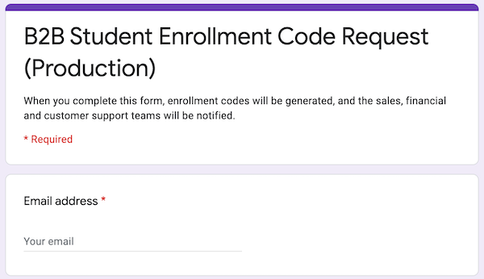
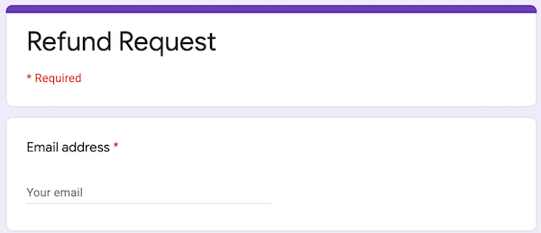
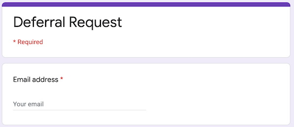
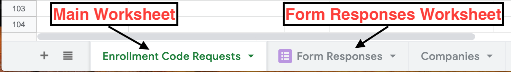
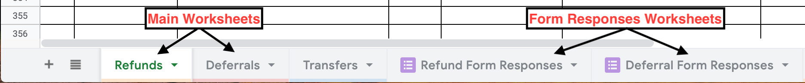

# xPRO Google Sheets

**SECTIONS**
1. [What Is This?](#what-is-this)
1. [How It Works](#how-it-works)
1. [Types of Sheets](#types-of-sheets)
1. [Sheet Basics](#sheet-basics)
1. [Troubleshooting](#troubleshooting)
1. [Development Setup](#development-setup)

## What Is This?

Rather than support web UIs for certain internal Customer Support and Finance tasks, we chose to support these tasks  
through UIs that are already very familiar to these teams: Google Sheets and Google Forms. 
Using various Google Drive and Sheets APIs, the following is now possible: 

1. CS/finance users can make various requests (e.g.: enrollment code creation/assignment, enrollment deferrals) by filling 
  out a Google Form or entering data into Google Sheets.
1. Those requests are automatically processed by our app.
1. Users can monitor the status of their requests directly in the spreadsheets.  

## How It Works

The basic workflow for most flavors of xPRO sheets is roughly as follows:

1. A user fills out a Google Form. That form submission is a request for some work to 
be done, and it is automatically added to a form responses worksheet within a relevant spreadsheet.
    - That submission also appears in the main worksheet within the spreadsheet automatically via a query.
1. In response to the change in the spreadsheet, Google sends a file watch request to an endpoint in our app, which 
  indicates to us that the spreadsheet has been changed, so we may have some new/updated requests to handle.
1. Our app scans the main worksheet of the spreadsheet for new/updated rows and takes the appropriate action if the
  data is all valid (e.g.: issuing a refund, creating new enrollment codes, etc.)
1. If a request was completed for some row, or if an error occurred, our app updates certain columns in the 
  main worksheet to indicate the status of that request.

## Types of Sheets

Right now there are three sheet types:

1. Enrollment Code Request sheet (a.k.a. Coupon Request sheet)
1. Enrollment Code Assignment sheets (which are created based on Enrollment Code Request sheet entries)
1. Change of Enrollment Request sheet. This includes worksheets for the following:
    1. Refund Requests
    1. Deferral Requests

New requests for the "request"-type sheets are submitted via Google Form:

1. Enrollment Code Request form
    
    
    
1. Refund Request form
    
    
    
1. Deferral Request form
    
    

#### Enrollment Code Request sheet

This spreadsheet keeps track of individual requests for enrollment codes. Each request for a set of enrollment 
codes is represented by a row, and requests are fed into the spreadsheet via Google Form. 
**None of the rows of this sheet should be edited manually.**

When a row of the enrollment code request sheet is processed, a set of enrollment codes are created according to the
request, and an assignment sheet is created so the codes can be assigned to individual users (see below). After a row 
is processed, a "Date Processed" date is added to indicate the request was fulfilled. 

#### Enrollment Code Assignment sheets

This spreadsheet allows admins to assign enrollment codes to individual users by email. Admins can manually enter
emails to assign the enrollment codes to those users.
**Only the "email" column of an assignment sheet should be edited manually, and only if the "status" column of that 
row has (a) no value, meaning it has not yet been processed, or (b) an error/failure status, which usually 
indicates that the email was invalid.**

When a row of the enrollment code request sheet is processed, our app scans the sheet for rows that have a code and
an email. If the enrollment code assignment doesn't already exist, a new enrollment code assignment is created, and the
user is emailed with an invitation to use that code and register for the given course run. After that, the "Status" 
column is updated automatically if the user opens the email, clicks on the enrollment code link, or enrolls in the 
course using that code.

_NOTE #1:_ The "Status" for an individual assignment will not be updated immediately after the invitation email is sent.
It usually takes a short time for our email provider to deliver the message, and our app periodically checks on the
status of these bulk enrollment emails and, if necessary, updates the sheet. The "Status" _is_ updated immediately after
a user completes enrollment using the code.

_NOTE #2:_ The "Enrolled Email" column will be filled in if a user redeemed the enrollment code on the same row using
an email that is different from the one assigned.

#### Change of Enrollment Request sheet (Refunds, Deferrals)

_Details to be filled in later..._

## Sheet Basics

The terms "main worksheet" and "form responses worksheet" are used below. Here are some
screenshots to explain what those terms are referring to:

**Enrollment Code Request worksheet tabs:**



**Change of Enrollment Request worksheet tabs:**



Some basic details for understanding and interacting with these spreadsheets:

1. One cardinal rule to follow for all of the "request"-type sheets: **Do not edit the main worksheet directly, unless the 
  columns exist specifically for direct user input**. Examples of columns that are intended for direct user input are the 
  Finance columns in the Change of Enrollment sheets.
1. If a row in any spreadsheet was successfully processed by our app, there should be a timestamp in a column called 
  "Date Processed"/"Completed Date"/etc., or a success status in the "Status" column.
1. If there is an error in some row (e.g.: a typo), there should be a message in the "Errors" column, or a 
  failure status in the "Status" column. See the section below for instructions about responding to errors.
1. The URL of any spreadsheet includes the spreadsheet ID, which may be needed for admin tasks like running 
  management commands. 
  Example spreadsheet URL: `https://docs.google.com/spreadsheets/d/1abc0f51PieXH3GT-lRCGityMR1234Ma2C9wZdf-QxyZ/edit#gid=0` 
  The spreadsheet ID in the example above is `1abc0f51PieXH3GT-lRCGityMR1234Ma2C9wZdf-QxyZ`.

## Troubleshooting

### All the data in a "request"-type sheet went away, and the first data cell value is "#REF!"
This happens when data is manually entered into the sheet in a column that isn't meant for manual entry. The fix is
easy:

1. Highlight the "#REF!" cell
1. A tooltip should pop up with an error message like this: "Array result was not expanded because it would 
   overwrite data in <some cell address>." Note that cell address.
1. Delete the data in the cell address from the error message above.

### Handling data errors (e.g.: typos, duplicate names) in a "request"-type sheet

As stated above, data entry errors cannot be fixed by directly updating the main worksheet in these spreadsheets. 
You have two options for addressing errors: editing the submitted form data, or setting the row to "ignored".

##### Editing Rows

**When you'll want to edit:** there is some bad data in a form submission (a typo, a naming conflict, etc).

**How to do it:** Find the row in the relevant "Form Responses" worksheet that matches the row in the main 
spreadsheet and directly edit the columns there. 

Example scenario: On the Enrollment Code Request spreadsheet, some row has some detail in the Errors column indicating that a
user doesn't exist due to a misspelled email address. To fix this, you would go to the "Form Responses" worksheet 
(which holds the the raw response data from the form), find the row that matches the one you saw on the main worksheet
with the error text, and updated the email column value there. 

Google sends file watch requests to our app if anything in the spreadsheet is edited, so those changes to the Form
Responses data should be handled automatically.

##### Ignoring Rows 

**Request rows cannot be deleted, only set to "ignored".** There are a couple different reasons for this. 
 
**When you'll want to set a row to ignored:** The request is no longer relevant (for example, the request is an accidental repeat). 

**How to do it:** Find the row in the relevant Form Responses worksheet that matches the
row on the main worksheet (check the "Editing Rows" section for details), **and enter `=TRUE` into the "Ignored?" 
column of that row in the Form Responses worksheet.** 

Ignored rows will be greyed out on the main worksheet, and the app will automatically skip over all request rows that 
are set to ignored. 

### Changes to a sheet are not being processed

_NOTE: This can only be fixed by someone on the engineering team._
Our app is set up to automatically listen for updates to these spreadsheets, but the service that notifies our app
about updates can be flaky. If a change has been made to a spreadsheet, and after a half a minute or so there is no 
feedback on the sheet indicating that the change has been processed, you can use a management command to renew the
"file watch". After this, the changes to the spreadsheet should be processed, and any further changes should continue
to be processed automatically.

```bash
# Renew the file watch for a specific spreadsheet
python ./manage.py setup_file_watch --sheet-id <spreadsheet ID>
# Renew ALL file watches that are expired
python ./manage.py setup_file_watch
```

### Enrollment code emails from an assignment sheet are not going out

_NOTE: This can only be fixed by someone on the engineering team._
If some enrollment codes have been assigned to a set of users, our app should automatically email those users with
their enrollment codes. If those emails don't seem to be going out (i.e.: the "Status" is not
changing to `delivered`, `opened`, et al.), one of a few things could be happening:

1. The assignments were not created (rows have a blank status). In this case the file watch is probably not up to date, 
   so the changes weren't detected and the enrollment code assignments were not created in the first place. 
   You just need to run the `setup_file_watch` command as described above.
2. The assignments were created (rows have `assigned` status), and at least a couple hours have passed, but it seems 
   that the emails have not gone out. In that case you would use the `sync_assignment_sheet` management command.
   
    ```python ./manage.py sync_assignment_sheet --sheet-id <spreadsheet ID>```
3. The assignments were created within the last couple hours and the status is still `assigned` instead of `delivered` 
   et al. As mentioned above, the delivery status is updated periodically, not immediately after the email is sent.
   In this case you can wait for the periodic task to run, or if you need to check on the results now, run the 
   `update_assignment_message_statuses` command.
   
    ```python ./manage.py update_assignment_message_statuses --sheet-id <spreadsheet ID>```
    
### Google Apps Script error emails

We sometimes get emails from Google with a subject line like this: 

> Summary of failures for Google Apps Script: ...

**Please note that the failure of this script has no real
effect on the app, and all spreadsheet functionality should still work even if these scripts are failing.** 
The Apps Scripts that are being referred to in these messages are scripts that update the list of company names in the "Company" 
dropdown in a corresponding Google form. The scripts are run when a "request"-type spreadsheet changes, and the company names come from a 
worksheet within the spreadsheet that can be manually updated to reflect all of our partners. It's important that we have an up-to-date list of companies for our CS reps to choose from when they fill out a request form, but as stated above, this doesn't affect any critical functionality.

Depending on the error message and the frequency of emails, we should respond in a few different ways:

1. **The error message is something like "We're sorry, a server error occurred. Please wait a bit and try again.", and we have not received a large number of emails.** – The Apps Script service seems to be prone to intermittent failures. If we receive an error message like this, and we only receive one or several of them, we don't need to take any immediate action. The service will likely come back up on its own.
1. **The error message is the one described above, and we are receiving a large number of emails.** – In this case, it's still possible that there is just an extended outage. The best approach is just to wait and see, and if the error emails persist for a few days, contact a developer to try running the script manually. If the script succeeds after being run manually, it's probably best just to get rid of the script trigger (meaning the script will not run when the spreadsheet changes).
1. **The error message is something like "The domain policies associated with the user are invalid or non existent."** – In this case it's best to delete the script trigger for the given spreadsheet, create a new version of the same script (just copy/paste the contents into a new script), and set up a new trigger which calls that new script.


## Development Setup

Instructions can be found here: [xPRO Google Sheets - Developer Setup](./dev-setup.md)
